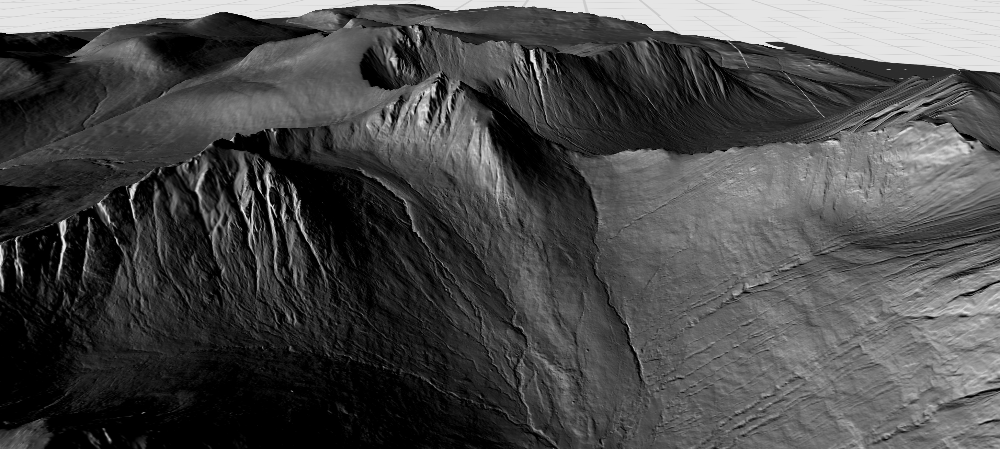
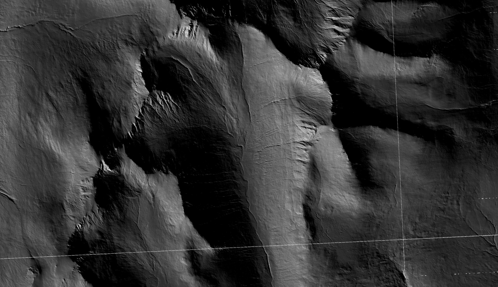
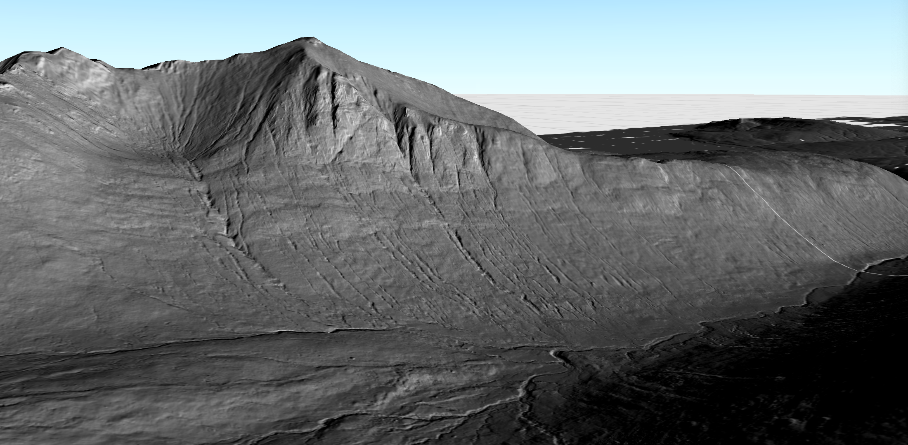

# Code it: creating hillshade effects using ArcGIS Runtime #

*This is the first in a series of blog posts intended for GIS professionals who have an interest in learning how to code geospatial workflows already familiar to them, using Esri's ArcGIS Runtime APIs. In this blog, I share a bitesized workflow which uses Java to visualise open source LiDAR data with a hillshade renderer, and display it in a desktop application.*


*Mountains of the Isle of Arran, Scotland, using 1m resolution open source LiDAR data to create a realistic hillshade effect, with a low angle light source simulating sunset. The view is north oriented. Made using ArcGIS Runtime for Java API, data Copyright Scottish Government and SEPA (2014).*

The first cartographic technique I came across during my early career in geology was that of applying hillshade renderers to digital elevation models, in order to make the dull, flat, greyscale raster **pop** into life as a realistic 3D landscape with depth and dimension. Hillshade rendering uses highlights and shadows to create this 3D landscape, and is an invaluable tool in picking out subtle landscape features during the desk study phase of any geological investigation. It was one of my favourite tools when using ArcGIS Pro (well, ArcMap at the time!), with many an hour disappearing playing with the settings to maximise landscape features that would later become the focus of a field survey: is that long sinuous feature an esker (marking the site of a river which once flowed beneath a glacier) and therefore worthy of a field study, or is it human-made and therefore not of interest in a glacial deposit field survey? When I changed careers and joined the ArcGIS Runtime for Java API team as a product engineer, I was delighted to discover much of the functionality I loved from Esri's desktop software was present in their Runtime offerings. // FLOW CHART FOR PROCESS

There are many great blogs/tutorials about hillshade rendering in Esri's flagship product ArcGIS Pro, so I won't be detailing that here. Instead, I want to share an alternative, coded approach to using ArcGIS Pro which achieves similar visually stunning hillshaded results using ArcGIS Runtime, and inspire GIS professionals interested in coding to give it a go.  I'll show how easy it is to load raster data into a desktop application using the ArcGIS Runtime for Java API, and how to apply a hillshade renderer to it and create a 3D  visually realistic virtual landscape. The results are as you would expect from ArcGIS Pro, but with the added fun of you get to code it up yourself and customise your application how ever you want.

## Data ##

I'm using the open source Scottish Public Sector LiDAR data from the [Scottish Remote Sensing Portal](https://remotesensingdata.gov.scot/), made available under the Open Government Licence v3 (*copyright Scottish Government and SEPA (2014)*). These are incredibly detailed data sets covering parts of Scotland, including complete 1m resolution coverage of the Isle of Arran via the LiDAR for Scotland Phase II DTM dataset. Arran is a geological playground with varied topography, and I couldn't wait to load it up in Runtime and see the results. I was really impressed this caliber of data was freely and openly available: check it out if you haven't already, there's a handy web-map interface where you can see the coverage, including 25cm resolution in parts of the Outer Hebrides.

## The Code ##

*In this blog I'll be dropping straight in to our geospatial code to show you how to set up a hillshade renderer: if you want to learn more about setting up an application using the ArcGIS Runtime for Java API see our [getting started tutorial](https://developers.arcgis.com/java/maps-2d/tutorials/display-a-map/). You can also find the source code for this blog on [Github](https://github.com/Rachael-E/arran-runtime-blog-post): clone this to run the application on your machine.*

To begin, we need a 3D space to create, display and render our data. Start by creating an `ArcGISScene` class along with a new `SceneView`. The `ArcGISScene` is the equivalent of a 3D scene in ArcGIS Pro, and hosts layers that can be displayed in 3D. The `SceneView` is the user interface that displays scene layers and graphics in 3D, and is the equivalent of the view pane in ArcGIS Pro.

```java
// create a scene and scene view
var scene = new ArcGISScene();
var sceneView = new SceneView();
```

Next, bring the data (in GeoTiff format) into the application (you can either download your own data, or access the LiDAR tiles for Arran via a [hosted open item on ArcGIS Online](https://arcgisruntime.maps.arcgis.com/home/item.html?id=ce99a45b9e664b4ebe3cb1cedf552b1d)).

```java
// get the GeoTiffs that contain 1m lidar digital terrain model (data copyright Scottish Government and SEPA (2014)).
List<String> tifFiles = new ArrayList<>(Arrays.asList(
  new File("./data/arran-lidar-data/NS02_1M_DTM_PHASE2.tif").getAbsolutePath(),
  new File("./data/arran-lidar-data/NS03_1M_DTM_PHASE2.tif").getAbsolutePath(),
  new File("./data/arran-lidar-data/NS04_1M_DTM_PHASE2.tif").getAbsolutePath(),
  new File("./data/arran-lidar-data/NR82_1M_DTM_PHASE2.tif").getAbsolutePath(),
  new File("./data/arran-lidar-data/NR83_1M_DTM_PHASE2.tif").getAbsolutePath(),
  new File("./data/arran-lidar-data/NR84_1M_DTM_PHASE2.tif").getAbsolutePath(),
  new File("./data/arran-lidar-data/NR93_1M_DTM_PHASE2.tif").getAbsolutePath(),
  new File("./data/arran-lidar-data/NR92_1M_DTM_PHASE2.tif").getAbsolutePath(),
  new File("./data/arran-lidar-data/NR94_1M_DTM_PHASE2.tif").getAbsolutePath(),
  new File("./data/arran-lidar-data/NR95_1M_DTM_PHASE2.tif").getAbsolutePath()
));
```

Now for the fun part! The hillshade renderer parameters are set up via the constructor for a new `HillshadeRenderer` class. If you are familiar with ArcGIS Pro's hillshade toolset, you'll recognise the [same parameters](https://pro.arcgis.com/en/pro-app/latest/tool-reference/3d-analyst/how-hillshade-works.htm).
- `altitude` - light's angle of elevation above the horizon, in degrees
- `azimuth` - light's relative angle along the horizon, in degrees; measured clockwise, 0 is north
- `zFactor` - factor to convert z unit to x,y units

I went for parameters which would mimic sunset conditions in November, to create a visually striking hillshade effect and emphasise the deepening shadows in the valleys of the Isle of Arran before the sun falls below the horizon.

```java
// create a new hillshade renderer that is representative of low light conditions (at sunset) early November 2021 over Scotland
var hillshadeRenderer = new HillshadeRenderer(10, 225, 1); // altitude, azimuth, zFactor
```

// IMAGE SHOWING WHAT THIS LOOKS LIKE LIKE

This hillshade renderer instance can be applied to multiple raster layers, which we have to programatically make from the data. Loop over each geotiff, and for each one of them, create a new `Raster` from the geotiff, and then create a `RasterLayer` from the raster. A `Raster` class represents raster data that can be rendered using a `RasterLayer`, and in this demo's case can be created from a raster file on device, using `Raster(String)`. A `RasterLayer` is required to display raster data in the scene.

```java
// loop through the geotiffs
for (String tifFile : tifFiles) {

  // create a raster from every GeoTIFF
  var raster = new Raster(tifFile);
  // create a raster layer from the raster
  var rasterLayer = new RasterLayer(raster);
}
```

Now we can apply the hillshade renderer to the raster layers, and add them to the ArcGIS Scene's collection of operational layers in order to display them in the scene.

```java
// set a hillshade renderer to the raster layer
rasterLayer.setRasterRenderer(hillshadeRenderer);
// add the raster layer to the scene's operational layers
arcGISScene.getOperationalLayers().add(rasterLayer);
```

The hillshade renderer is applied, and the raster data is displayed on the scene: and looks great, just like you'd expect from the equivalent ArcGIS Pro hillshade toolset. Already features in the landscape are **popping** into life in the same exciting way I remember from my ArcGIS Pro days.


*The hillshade is applied to the raster data, creating a visual 3D effect. This view, oriented north, is looking directly down on to the bowl shaped glacial corrie at the head of Glen Rosa, Arran. Data Copyright Scottish Government and SEPA (2014).*

The final twist in this bitesized coding tale is to make full use of the geotiff data and not only make the landscape *look* 3D, but actually **make** it 3D, by creating a 3D surface. We do this in Runtime by instantiating a new `RasterElevationSource` with the list of geotiffs provided as a parameter. Create a new `Surface`, get its list of elevation sources and add the `rasterElevationSource` to it. Finally, set the surface as the base surface of the ArcGIS Scene.

```java
// create an elevation source from the GeoTIFF (raster) collection
var rasterElevationSource = new RasterElevationSource(tifFiles);

// create a surface, get its elevation sources, and add the raster elevation source to the collection
var surface = new Surface();
surface.getElevationSources().add(rasterElevationSource);
// set the surface to the scene
arcGISScene.setBaseSurface(surface);
```


*The surface of the ArcGIS Scene is now truly 3D, with the geotiff data used to create an elevation source. This view is oriented east, and is looking towards the western flank of the mountain of Goatfell, Arran. Data Copyright Scottish Government and SEPA (2014).*

And tada, that's it! In only a few lines of code, a hillshade effect is rendered quickly and easily using the open source LiDAR data, and a 3D base surface created to provide a simple, high resolution 3D digital twin of the Isle of Arran as it would appear at low lighting conditions from the west on a November evening.

As when using Esri's desktop offerings, visual analysis of this data running in a native application is invaluable for desktop studies. With ArcGIS Runtime, you can customise this application even further by  exploring the functionality that the [native APIs from Esri](https://developers.arcgis.com/documentation/mapping-apis-and-services/apis-and-sdks/#native-apis) give you or integrate it into your workflow to create powerful geospatial workflows.

// FOLLOW THROUGH: GEOLOGICAL FIELD TRIP WITH VIEWPOINT? LIDAR DATA SOURCE? CLIFFHANGER
