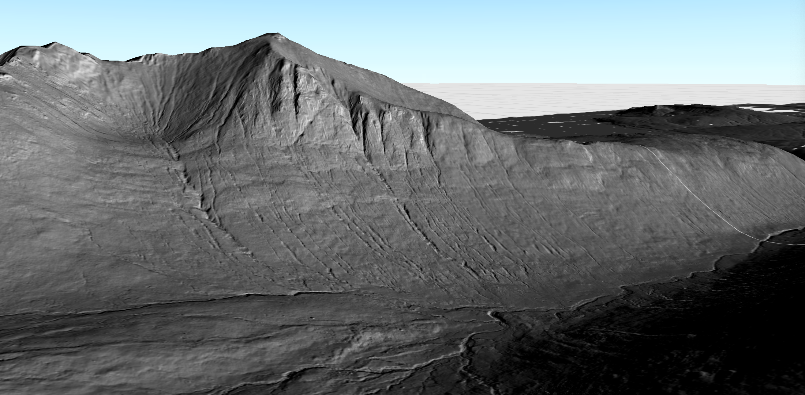

# ArcGIS Runtime: Create hillshade effects with geospatial code #

The accompanying blog for this code demo can be found on [the Esri blog webpage](https://www.esri.com/arcgis-blog/products/api-java/developers/arcgis-runtime-create-hillshade-effects-with-geospatial-code/). This demo application can be run via an IDE such as IntelliJ, please see instructions below. 

When the demo application launches, simply explore the data by interacting with the scene view via the mouse or keyboard. 

Please note, the data in this sample will automatically download on the first run. This may take a while depending on your internet connection speed.

## Instructions

### IntelliJ IDEA

1. Open IntelliJ IDEA and select _File > Open..._.
2. Choose the arcgis-runtime-java-demos directory and click _OK_.
3. Select _File > Project Structure..._ and ensure that the Project SDK and language level are set to use Java 17.
4. Open the Gradle view with _View > Tool Windows > Gradle_.
5. In the Gradle view, double-click `copyNatives` under _Tasks > build_. This will unpack the native library dependencies to $USER_HOME/.arcgis.
6. In the Gradle view, double-click `run` under _Tasks > application_ to run the app.

### Command Line

1. `cd` into the project's root directory.
2. Run `./gradlew clean build` on Linux/Mac or `gradlew.bat clean build` on Windows.
3. Run `./gradlew copyNatives` on Linux/Mac or `gradlew.bat copyNatives` on Windows. This will unpack the native library dependencies to $USER_HOME.arcgis.
3. Run `./gradlew run` on Linux/Mac or `gradlew.bat run` on Windows to run the app.

## Requirements

See the Runtime SDK's [system requirements](https://developers.arcgis.com/java/reference/system-requirements/).
